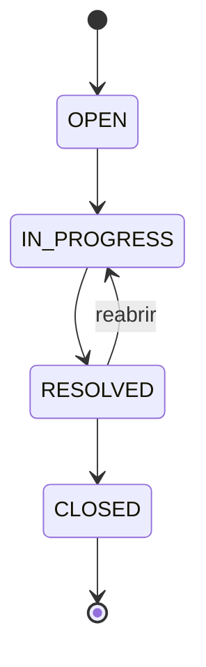

# Helpdesk API · Java & Spring Boot

API REST para abertura e acompanhamento de chamados técnicos, com prioridade, histórico e regras de mudança de status.

**Java 17 · Spring Boot 4.0.7 · REST · JDBC · SQL · H2 · JUnit**

Projeto didático de portfólio de [Erick Gomes](https://github.com/Gmerick), criado com apoio de IA. Usa situações fictícias inspiradas em suporte e infraestrutura; não representa uma operação em produção.

## O problema

Um chamado não deve ser encerrado sem passar pelo atendimento, e toda mudança precisa deixar um histórico. Esta API mantém o estado e a auditoria na mesma transação e retorna erros claros para entradas inválidas e transições não permitidas.

## Executar

Pré-requisitos: **JDK 17+**, **Maven 3.6.3+**, Git. Confira `java -version`, `javac -version` e `mvn -version`. A primeira compilação precisa de internet.

```bash
git clone https://github.com/Gmerick/java-helpdesk-api.git
cd java-helpdesk-api
mvn clean verify
java -jar target/app.jar
```

A API inicia em **http://localhost:8081**. Não existe página HTML na raiz; use os endpoints abaixo. O banco H2 é persistido em `data/helpdesk.mv.db`. Para testar a resposta pelo navegador, abra `http://localhost:8081/api/tickets/summary`.

Em outro terminal, se tiver Python 3 instalado, rode a demonstração automática:

```bash
python scripts/demo.py
```

Ela cria um chamado fictício, percorre o fluxo, testa um erro 409 e mostra o histórico. Pode ser repetida: cada execução cria um novo chamado. Também há [requisições HTTP prontas](examples/requests.http) para a IDE ou Postman.

### Primeiro chamado no PowerShell

```powershell
$body = @{ title='VPN indisponivel'; description='Rede de laboratorio'; priority='HIGH' } | ConvertTo-Json
$ticket = Invoke-RestMethod -Method Post -Uri 'http://localhost:8081/api/tickets' -ContentType 'application/json' -Body $body
$ticket
$change = @{ status='IN_PROGRESS'; note='Iniciando diagnostico' } | ConvertTo-Json
Invoke-RestMethod -Method Patch -Uri "http://localhost:8081/api/tickets/$($ticket.id)/status" -ContentType 'application/json' -Body $change
```

## Endpoints

| Método | Rota | Comportamento |
| --- | --- | --- |
| POST | `/api/tickets` | Cria e retorna 201 + Location |
| GET | `/api/tickets?status=OPEN&limit=20&offset=0` | Lista com filtro opcional e paginação |
| GET | `/api/tickets/{id}` | Consulta um chamado |
| PATCH | `/api/tickets/{id}/status` | Altera status e registra justificativa |
| GET | `/api/tickets/{id}/history` | Histórico ordenado de criação e mudanças |
| GET | `/api/tickets/summary` | Quantidade por status, incluindo zeros |

Prioridades: `LOW`, `MEDIUM`, `HIGH`. `limit`: 1 a 100; `offset`: não negativo. Respostas de erro usam ProblemDetail: **400** entrada inválida, **404** não encontrado, **409** transição ou integridade em conflito.

## Fluxo permitido



Não é permitido pular etapas, repetir o status atual ou reabrir um chamado fechado. O PATCH usa comparação do status esperado no UPDATE para detectar alteração concorrente.

## Organização e banco

- `TicketController`: DTOs validados e contrato HTTP.
- `TicketService`: ciclo de vida e transações.
- `TicketRepository`: SQL parametrizado com JdbcTemplate.
- `Ticket`: record e enums de domínio.
- `ApiErrors`: respostas padronizadas sem revelar SQL.
- `schema.sql`: tabelas `tickets` e `ticket_history` relacionadas por FK.

A criação também registra auditoria. Falha no INSERT do histórico desfaz a atualização do chamado. [Consultas SQL de exemplo](examples/queries.sql).

## Configuração

| Variável | Padrão |
| --- | --- |
| `PORT` | `8081` |
| `SERVER_ADDRESS` | `127.0.0.1` |
| `DB_URL` | `jdbc:h2:file:./data/helpdesk` |
| `DB_USERNAME` | `sa` |
| `DB_PASSWORD` | vazio, apenas laboratório local |

Para um banco temporário: `java -jar target/app.jar --spring.datasource.url=jdbc:h2:mem:demo`. Para trocar a porta: `--server.port=9081`. Ao usar uma porta diferente, passe a URL ao demo: `python scripts/demo.py http://localhost:9081`.

Para reiniciar o banco persistente, pare a aplicação e renomeie `data` como backup. `CREATE TABLE IF NOT EXISTS` preserva os registros ao reiniciar normalmente.

## Testes, Docker e entrevista

```bash
mvn clean verify
# Opcional, requer Docker:
docker compose up --build -d
docker compose down
```

Pare a execução Java antes de usar Compose na mesma porta. O volume preserva os dados. Não há Docker obrigatório para estudar.

- [Roteiro de apresentação em 5 a 10 minutos](docs/APRESENTACAO.md)
- [Guia de estudo](docs/ESTUDO.md)
- [Decisões técnicas](docs/DECISOES.md)
- [Resultados de validação](docs/VALIDACAO.md)
- [Proposta de laboratório AWS](docs/AWS.md)

## Limitações

Sem autenticação, usuários, anexos, notificações ou SLA. Use dados fictícios e acesso local. O histórico não identifica um usuário autenticado. H2 e esquema inicial são adequados ao laboratório; migrações e outro banco exigem trabalho adicional. Não houve implantação AWS.
